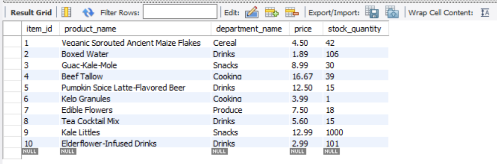

# Store-Inventory-Manager
## Purpose
```
Create an app that will:

1. Guide customer through a store catalogue
2. Take the customer's order
3. Adjust the store's inventory
```
---
## Key Technologies
* Javascript
* Node.js
* mySQL
* NPM
    * Inquirer
    * mySQL
    * fs
    * dotenv
---
## Demos
1. ### Customer View
    * A database has been made for this app. Here all product information is stored, and inventory level is maintained  
    

    * Once the app is started, each product is listed, and the user may choose from any one of them  
    

    * After choosing, the user will be prompted to enter the amount to purchase  
    
    

    * After entering the order quantity, the app will summarize the customer's order, and adjust the inventory in the database to reflect the reduction in stock  
    
    


2. ### Non-number user entry
    * If an entry is made that is not a number, the user's entry will not be accepted, and the app will remain on this prompt  
    
    

3. ### Not Enough Inventory
    * If the user attempts to purchase more items than the total inventory of the store, the app will alert the user of the lack of inventory, and the app will close  
    
    